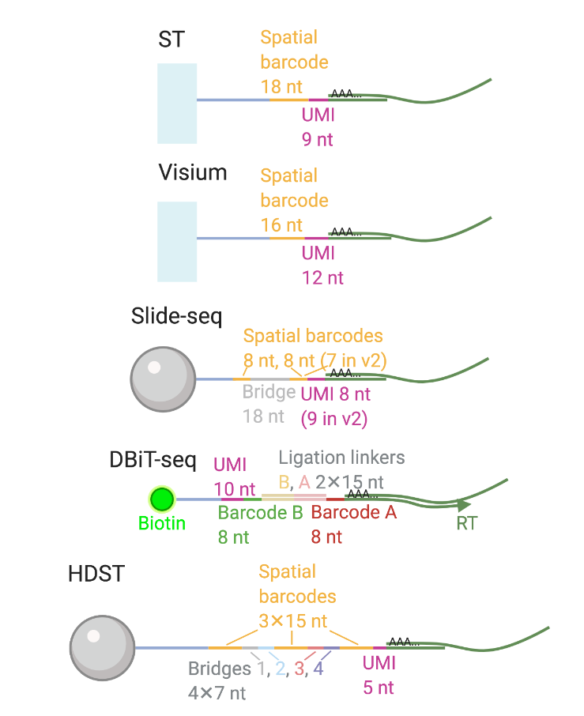
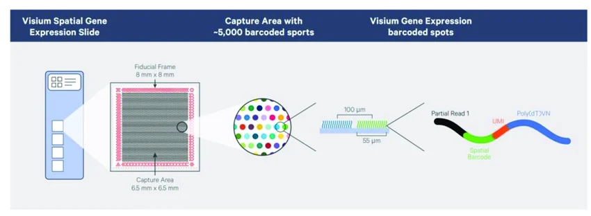
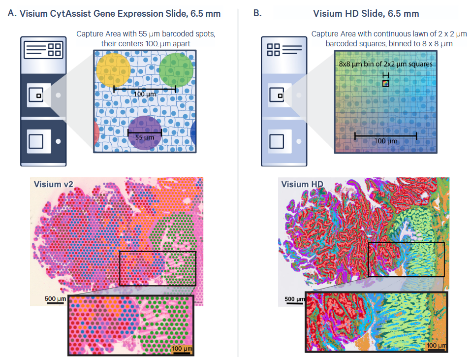
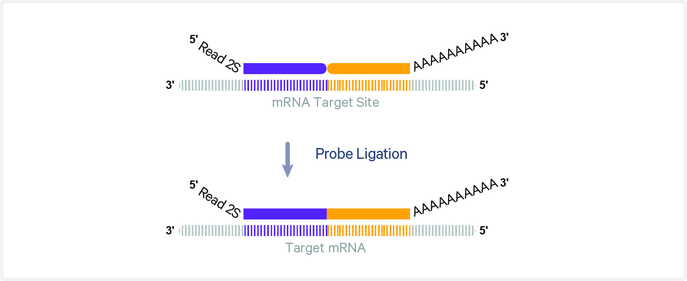

## Resumen de la Clase 1 {.smaller}

En la clase anterior cubrimos los **fundamentos teóricos** de las tecnologías espaciales basadas en secuenciación:

:::::: columns
::: {.column width="30%"}
**Conceptos clave:**

- Captura de transcritos en superficies con códigos de barras espaciales

- Diferencias entre tecnologías basadas en secuenciación vs. imagen

- El compromiso entre resolución, cobertura del transcriptoma y *throughput*

  **Directo a la práctica**: del FASTQ a la matriz de conteo.
:::

::: {.column width="40%"}
{height="600" fig-align="center" width="530"}
:::

::: {.column width="30%"}
**Tecnologías mencionadas:**

- **Visium** (10x Genomics) — spots de 55 µm
- **Slide-seq** — beads de \~10 µm
- **Stereo-seq** — 0.22 µm (BGI)
- **DBiT-seq** — microfluídica
:::
::::::

------------------------------------------------------------------------

## Visium v1/v2: Lo que ya conocemos {.smaller}

{fig-align="center" width="326"}

::::: columns
::: {.column width="50%"}
- \~5,000 spots por área de captura
- Cada spot: **55 µm** de diámetro
- Separación centro a centro: **100 µm**
- Gaps entre spots → pérdida de información
:::

::: {.column width="50%"}
- Cada spot captura **múltiples células** (\~1-10)
- Resolución insuficiente para análisis unicelular
- Requiere deconvolución computacional
- **Visium v1 y v2 serán descontinuados** en favor de HD (al parecer ya)
:::
:::::

------------------------------------------------------------------------

## Visium HD: La nueva generación {.smaller}

::::: columns
::: {.column width="40%"}
**Arquitectura del slide:**

- Misma área de captura: 6.5 × 6.5 mm
- \~**11 millones** de cuadrados con código de barras
- Cada cuadrado: **2 × 2 µm** — resolución sub-celular
- **Sin gaps** — cobertura continua del tejido

**Binning digital:**

- Los datos crudos son a 2 µm
- Space Ranger genera bins a 2, 8 y 16 µm
- **8 µm** es el punto de partida recomendado
- Se puede hacer binning personalizado (ej. bin2cell)
:::

::: {.column width="60%"}
| Característica      | Visium v2     | Visium HD              |
|---------------------|---------------|------------------------|
| Unidad              | Spot 55 µm    | Cuadrado 2 µm          |
| Cobertura           | Con gaps      | Continua               |
| \# Unidades         | \~5,000       | \~11 millones          |
| Resolución efectiva | Multi-celular | Sub-celular            |
| Tejidos             | FF, FFPE      | FF, FFPE, Fixed Frozen |

{width="461"}
:::
:::::

------------------------------------------------------------------------

## ¿Cómo funciona Visium HD? {.smaller}

El workflow es similar a Visium v2 con CytAssist:

1.  **Preparación del tejido** en portaobjetos de vidrio estándar
2.  **Tinción H&E o IF** e imagen con microscopio
3.  **Hibridación de sondas:** panel de transcriptoma completo (whole transcriptome probes FFPE) ó
4.  **Captura de sondas**: Fresh frozen con oligo polyDT
5.  **Ligación de sondas** en el tejido (si FFPE)
6.  **Transferencia con CytAssist:** las sondas ligadas se transfieren al slide Visium HD
7.  **Extensión y construcción de librería**: los códigos de barras espaciales se incorporan
8.  **Secuenciación** — configuración: 43 bp R1, 50 bp (75 bp FF) R2, 10 bp i7, 10 bp i5 (FFPE)

. . .

**Diferencia clave** Visium HD usa hibridación de sondas (probe-based FFPE), o captura poly-dT directa (fresh frozen). R1 es mayor por la mayor cantidad de cuadritos

------------------------------------------------------------------------

## Visium v2 vs HD: Lo que se mantiene {.smaller}

::::: columns
::: {.column width="50%"}
**Igual que antes:**

- Instrumento CytAssist para la transferencia
- Misma área de captura (6.5 × 6.5 mm)
- Procesamiento con Space Ranger
- Análisis downstream con Seurat/Scanpy
- Referencias genómicas de 10x (GRCh38, mm10)
- Formato de salida (matrices sparse, archivos H5)
:::

::: {.column width="50%"}
**Lo que cambia:**

- Resolución: 55 µm → 2 µm
- De spots con gaps → cobertura continua
- Sondas (probe-based) en lugar de poly-dT (v1)
- Archivos de salida mucho más grandes
- Se necesita el archivo `.vlf` del slide
- Requiere más recursos computacionales
- Concepto de **binning** digital post-hoc
:::
:::::

------------------------------------------------------------------------

## Nuestro dataset: Cáncer Colorrectal (Visium HD) {.smaller}

::::: columns
::: {.column width="60%"}
**Estudio:** Oliveira *et al.* (2025) *"High-definition spatial transcriptomic profiling of immune cell populations in colorectal cancer"*

📄 [Nature Genetics 57: 1512–1523](https://doi.org/10.1038/s41588-025-02193-3)

**Hallazgos principales:**

- Mapa de alta resolución del microambiente tumoral (TME) en CRC
- Identificación de subpoblaciones de macrófagos pro- y anti-tumorales
- Localización de células T clonalmente expandidas cerca de macrófagos anti-tumorales
- Validación cruzada con datos Xenium y scRNA-seq (Flex)
:::

::: {.column width="40%"}
**Datos del paciente:**

- Tejido: Colon sigmoide
- Preservación: FFPE
- Sexo: Masculino
- Edad: 60 años
- Slide: H1-VM2JXXK, Área A1

**Accesiones:**

- GEO: [GSE280318](https://www.ncbi.nlm.nih.gov/geo/query/acc.cgi?acc=GSE280318) (Super serie)
- GEO: [GSE280315](https://www.ncbi.nlm.nih.gov/geo/query/acc.cgi?acc=GSE280315) (Sólo Visium HD)
- [Dataset en 10x](https://www.10xgenomics.com/datasets/visium-hd-cytassist-gene-expression-libraries-of-human-crc)
- [Código en GitHub](https://github.com/10XGenomics/HumanColonCancer_VisiumHD)
:::
:::::

------------------------------------------------------------------------

## Descarga de los FASTQs desde SRA (No lo hagan!) {.smaller}

Ya están en las carpetas en `/mnt/data/transcriptomica/sra_visium_hd_clase_ST2`

Los datos crudos de secuenciación están depositados en el Sequence Read Archive (SRA). Para descargarlos usamos `prefetch` + `fasterq-dump` del SRA Toolkit:

``` bash

module load sra-tools 

# Buscar los SRR accessions asociados a GSE280318
# (se pueden encontrar en la página de GEO o con esearch)

# Descargar con prefetch (más robusto que fasterq-dump directo)
prefetch SRR12345678   # reemplazar con el accession real

# Convertir a FASTQ
fasterq-dump --split-files --threads 8 SRR12345678

# Comprimir (Space Ranger necesita .fastq.gz)
pigz -p 8 *.fastq
```

. . .

::: callout-tip
## Tip: sesiones persistentes

Slurm array job con una lista o:

``` bash
#4 archivos de un total de 20 cada vez
#SBATCH --output=logs/sra_%a.out
#SBATCH --error=logs/sra_%a.err
#SBATCH --array=1-20%4
module load sra-tools 
#La fila SLURM_ARRAY_TASK_ID del sra_list.txt
SRA_ID=$(sed -n "${SLURM_ARRAY_TASK_ID}p" sra_list.txt)

prefetch $SRA_ID   # reemplazar con el accession real

fasterq-dump "$TMP_DIR/$SRA_ID/$SRA_ID.sra" --split-files --threads $SLURM_CPUS_PER_TASK --temp $TMP_DIR --outdir ./

pigz -p $SLURM_CPUS_PER_TASK ${SRA_ID}*.fastq
```

Usa `tmux` o `screen` para que la descarga no se interrumpa si se cae la conexión SSH:

``` bash
tmux new -s descarga
# ... ejecutar descarga ...
# Ctrl+b, d para desconectar
# tmux attach -t descarga para reconectar
```
:::

------------------------------------------------------------------------

## Descarga de imágenes y matrices desde GEO {.smaller}

Además de los FASTQs, necesitamos las imágenes (CytAssist + microscopio) y opcionalmente las matrices pre-procesadas. Estas están en los archivos suplementarios de GEO:

``` bash
tmux new -s geo_images

# Explorar el contenido del FTP de GEO
curl -s "ftp://ftp.ncbi.nlm.nih.gov/geo/series/GSE280nnn/GSE280315/suppl/"

# Descargar el archivo RAW completo (~32 GB, contiene imágenes + matrices)
wget -c --timeout=60 --tries=10 --waitretry=30 \
  "ftp://ftp.ncbi.nlm.nih.gov/geo/series/GSE280nnn/GSE280315/suppl/GSE280315_RAW.tar" \
  -O GSE280315_RAW.tar

# Desempaquetar
tar -xvf GSE280315_RAW.tar

# Ctrl+b, d para desconectar tmux
```

. . .

::: callout-warning
## Importante sobre las URLs de GEO

los urls de ftp siguen un formato predecible GSE280nnn/GSEID/matrix\|suppl\| checa la documentación para tus fines [README geo ftp](https://ftp.ncbi.nlm.nih.gov/geo/README.txt)
:::

------------------------------------------------------------------------

## Archivos que necesitamos para Space Ranger {.smaller}

Para ejecutar `spaceranger count` con datos Visium HD FFPE necesitamos:

| Archivo | Descripción | Fuente |
|------------------------|------------------------|------------------------|
| FASTQs (R1, R2, I1, I2) | Lecturas de secuenciación | SRA / 10x |
| Imagen CytAssist (`.tif`) | Para alineación de fiduciales | GEO (tar)/ 10x |
| Imagen microscopio (`.btf`) | H&E alta resolución (opcional) | GEO (tar) / 10x |
| Referencia genómica | GRCh38-2020-A | 10x downloads |
| Probe set (`.csv`) | Panel de sondas v2.0 | 10x downloads o carpeta SRanger |
| Slide layout (`.vlf`) | Geometría del slide H1-VM2JXXK | tar de GEO |

. . .

``` bash
# Referencia genómica (~15 GB descomprimida)
wget -c "https://cf.10xgenomics.com/supp/spatial-exp/refdata-gex-GRCh38-2020-A.tar.gz"
tar -xzvf refdata-gex-GRCh38-2020-A.tar.gz

# Probe set
wget -c "https://cf.10xgenomics.com/supp/spatial-exp/probeset/\
Visium_Human_Transcriptome_Probe_Set_v2.0_GRCh38-2020-A.csv"
#Spacerangeer ya está en la carpeta spaceranger-4.1.0/probe_sets/
```
SpaceRanger ya está instalado en `/mnt/data/transcriptomica/sra_visium_hd_clase_ST2/software/spaceranger-4.1.0`

Y la referencia está en 

`/mnt/data/transcriptomica/sra_visium_hd_clase_ST2/software/refdata-gex-GRCh38-2020-A`

------------------------------------------------------------------------

## Instalación de Space Ranger (sin permisos de admin) {.smaller}

Space Ranger es un tarball autocontenido — no requiere `sudo` ni gestor de paquetes:

``` bash
# 1. Crear directorio para software
mkdir -p ~/software && cd ~/software

# 2. Descargar (obtener URL de https://www.10xgenomics.com/support/
#    software/space-ranger/downloads)
wget -O spaceranger-3.0.0.tar.gz \
  "https://cf.10xgenomics.com/releases/space-ranger/spaceranger-4.1.0.tar.gz"

# 3. Desempaquetar
tar -xzvf spaceranger-4.1.0.tar.gz

# 4. Agregar al PATH
export PATH=..../software/spaceranger-4.1.0:$PATH
echo 'export PATH=.../software/spaceranger-4.1.0:$PATH' >> ~/.bashrc

# 5. Verificar
spaceranger --version
```

. . .

::: callout-note
## ¿Qué incluye el tarball?

Space Ranger empaqueta **todo**: su propio Python, su propio STAR, todas las dependencias. No necesita nada del sistema excepto un kernel Linux razonablemente moderno (glibc ≥ 2.17).
:::

------------------------------------------------------------------------

## Ejecutando Space Ranger en el cluster {.smaller}

``` bash
#!/bin/bash
#SBATCH --job-name=spaceranger_crc
#SBATCH --cpus-per-task=16
#SBATCH --mem=64G
#SBATCH --output=spaceranger_%j.log

export PATH=/mnt/data/transcriptomica/sra_visium_hd_clase_ST2/software/spaceranger-4.1.0:$PATH
fastqdir="/mnt/data/transcriptomica/sra_visium_hd_clase_ST2/P5NAT_GSM8594571"

spaceranger count \
  --id=CRC_VisiumHD_P5NAT \
  --transcriptome=/mnt/data/transcriptomica/../software/refdata-gex-GRCh38-2020-A \
  --fastqs=$fastqdir \
  --sample=SRR31118571,SRR31118572,SRR31118573,SRR31118574 \
  --probe-set=/mnt/data/transcriptomica/../software/spaceranger-4.1.0/probe_sets/Visium_Human_Transcriptome_Probe_Set_v2.0_GRCh38-2020-A.csv \
  --cytaimage=$fastqdir/*_P1CRC_image.tif \
  --slide=H1-YD7CDZK \
  --area=A1 \
  --output-dir=$fastqdir/results \
  --slidefile=$fastqdir/GSM8594567_P1CRC_slide_file.vlf \
  --create-bam=false \
  --localcores=${SLURM_CPUS_PER_TASK} \
  --localmem=60 \
  --disable-ui
```

. . .

⚠️ **Siempre** usar `--localcores` y `--localmem` en un cluster para no abusar de los recursos compartidos.

Necesita los archivos descomprimidos

Necesita que los fastqs se llamen {SampleID}\_S1_R{1,2}\_001.fastq.gz

------------------------------------------------------------------------

## ¿Qué produce Space Ranger? {.small}

Para entender mejor los [outputs](https://www.10xgenomics.com/support/software/space-ranger/latest/analysis/outputs/output-overview)

```         
CRC_VisiumHD/outs/
├── web_summary.html              # Reporte QC interactivo (todos los bins)
├── spatial/                     # Información espacial
|
├── binned_outputs/               # ← NUEVO en HD
│   ├── square_002um/             # Bins a 2 µm
│   ├── square_008um/             # Bins a 8 µm (recomendado)
│   └── square_016um/             # Bins a 16 µm (para laptops)
|         ├── filtered_feature_bc_matrix.h5
|         ├── filtered_feature_bc_matrix/   # Matriz de conteo (bins bajo tejido)
│         |   ├── barcodes.tsv.gz
│         |   ├── features.tsv.gz
│         |   └── matrix.mtx.gz
|         ├── raw_feature_bc_matrix/        # Matriz completa
|         └── analysis/ #Clusters, DEGs, umaps etc.
└── cloupe.cloupe                  # Archivo para Loupe Browser
```

. . .

Para el análisis downstream en laptops, usaremos los bins de **16 µm** por su menor tamaño computacional.

------------------------------------------------------------------------

## Alternativa open source: STARsolo {.smaller}

**¿Por qué una alternativa?**

- Space Ranger es software propietario (aunque gratuito)
- STARsolo es GPL, parte de STAR ya instalado en clúster
- Sólo jugar para ver **qué hace Space Ranger por dentro**
- Rápido para el paso de alineamiento

. . .

**¿Qué hace STARsolo?**

Lo mismo que el *core* de Space Ranger/Cell Ranger:

1.  Demultiplexar códigos de barras espaciales
2.  Alinear lecturas al genoma de referencia (STAR)
3.  Colapsar UMIs (deduplicación)
4.  Generar matriz de conteo (genes × barcodes)

. . .

**¿Qué NO hace?**

- Detección de tejido en la imagen H&E
- Alineación de fiduciales
- Binning (2 µm → 8 µm → 16 µm)
- Generación del directorio `spatial/`
- Pero...

------------------------------------------------------------------------

## STARsolo {.smaller}

Para Visium estándar, STARsolo es un reemplazo directo. Para Visium HD, la arquitectura de barcode multi-segmento (43bp, \~11M posiciones) y la química basada en sondas hacen que Space Ranger sea, en la práctica, la única opción actualmente. Este es un ejemplo real de cómo las herramientas open source a veces necesitan tiempo para alcanzar a las plataformas comerciales.



------------------------------------------------------------------------

## Pregunta Qué binneado corresponde a las matrices descargadas de GEO? {.smaller}

Checar el web summary

------------------------------------------------------------------------

## Resumen del flujo de trabajo {.smaller}

```{mermaid}
%%| fig-width: 10
flowchart LR
    A[FASTQs<br/>SRA] --> D[Space Ranger]
    D --> C[Matriz +<br/>spatial/]
    E[Imágenes<br/>GEO/10x] --> D
    F[Referencia<br/>GRCh38] --> D
    G[Probe set<br/>+ slide file] --> D
    C --> H[Análisis<br/>downstream<br/>Seurat/Scanpy]
```

------------------------------------------------------------------------

## Volvamos a los datos de cáncer descargados de GEO

Como en los programas de cocina, vamos a trabajar como si ya hubiera terminado el pipeline con los datos descargados de GEO. Visium HD de un paciente con cáncer colorrectal (P2CRC) del estudio de [Oliveira](#0)[*et al.*](https://doi.org/10.1038/s41588-025-02193-3)[(2025)](#0).

Trabajaremos con archivos descargados directamente de GEO, **sin** la estructura completa de directorios de Space Ranger. Esto es un escenario realista muchas veces los datos públicos vienen así.

::::: columns
::: {.column width="50%"}
### Archivos que necesitamos:

```         
outs/ 
├── filtered_feature_bc_matrix.h5 
└── binned_outputs/     
  └── square_008um/         
          ├── filtered_feature_bc_matrix.h5  
          └── spatial/            
                ├── tissue_positions.parquet             
                ├── tissue_lowres_image.png             
                └── scalefactors_json.json 
```
:::

::: {.column width="50%"}
### Pero podemos librarla con:

```         
pacienteID/outs
    ├── (SOMEID)_filtered_feature_bc_matrix.h5 
    └── spatial/            
            ├── tissue_positions.parquet    #Cambiar el nombre     
            ├── (SOMEID)_tissue_lowres_image.png         
            └── scalefactors_json.json       #Cambiar el nombre
            
```
:::
:::::

------------------------------------------------------------------------

## Con Seurat

```{r}
#| label: setup
#| warning: false
## Instalar si es necesario (solo la primera vez) # install.packages(c("Seurat", "hdf5r", "ggplot2", "patchwork", "dplyr")) # install.packages("BiocManager") # BiocManager::install("glmGamPoi") # para SCTransform #o bien pak::pkg_install como recomendó Valeria

library(Seurat)
library(hdf5r)
library(ggplot2) 
library(patchwork)
library(dplyr)
library(arrow)
library(ape)
library(SpatialExperiment)
#Much faster implementation of find markers:
#pak::pak('immunogenomics/presto')
packageVersion("Seurat") 
## Debe ser >= 5.0.0

```

. . .

Verificar la versión de Seurat — necesitamos **v5+** para soporte de Visium HD

------------------------------------------------------------------------

### Descomprimir la imagen

```{bash}
#| label: decompress
#| eval: false
## Si la imagen está comprimida, mover archivos y cambiar nombres
gunzip GSM8594568_P2CRC_image.tif.gz

```

```{r}
#| label: cargaseurat
#object <- Load10X_Spatial(data.dir = "P5CRC_GSM8594569_results_16mum/", filename = "GSM8594567_P1CRC_filtered_feature_bc_matrix.h5", image.name = "GSM8594567_P1CRC_tissue_lowres_image.png")
object <- Load10X_Spatial(data.dir = "P5CRC_GSM8594569_results_16mum/", filename = "filtered_feature_bc_matrix.h5", image.name = "tissue_lowres_image.png")
```

------------------------------------------------------------------------

### Assays y plots

```{r}
#| label: violin
#| echo: true
#| warning: false
Assays(object) #En datos director de space ranger pueden ser diferentes resoluciones DefaultAssay(object)  
vln.plot <- VlnPlot(object, features = "nCount_Spatial", pt.size = 0) + theme(axis.text = element_text(size = 4)) + NoLegend()

count.plot <- SpatialFeaturePlot(object, pt.size.factor = 10, features = "nCount_Spatial") + theme(legend.position = "right")

vln.plot | count.plot 
```

------------------------------------------------------------------------

#### Subsetting opcional para que no tarde tanto

```{r}
#| label: getsubsetcoord
#| eval: true
#| echo: false
#| warning: false
count.plot <- SpatialFeaturePlot(object, features = "nCount_Spatial") +
  theme(legend.position = "right")
# Extract everything we need
plot_data <- ggplot_build(count.plot)$data[[1]]

x_cuts <- seq(min(plot_data$x), max(plot_data$x), length.out = 9)
y_cuts <- seq(min(plot_data$y), max(plot_data$y), length.out = 9)

ggplot(plot_data, aes(x = x, y = y, color = fill)) +
  geom_point(size = 0.1, shape = 15) +
  scale_color_identity() +
  # Grid
  annotate("segment",
    x = x_cuts, xend = x_cuts,
    y = min(plot_data$y), yend = max(plot_data$y),
    color = "white", linewidth = 0.3, linetype = "dashed") +
  annotate("segment",
    x = min(plot_data$x), xend = max(plot_data$x),
    y = y_cuts, yend = y_cuts,
    color = "white", linewidth = 0.3, linetype = "dashed") +
  # Column labels
  annotate("text",
    x = head(x_cuts, -1) + diff(x_cuts) / 2,
    y = rep(max(plot_data$y) + 5, 8),
    label = 1:8, color = "yellow", size = 3, fontface = "bold") +
  # Row labels
  annotate("text",
    x = rep(min(plot_data$x) - 5, 8),
    y = head(y_cuts, -1) + diff(y_cuts) / 2,
    label = LETTERS[1:8], color = "yellow", size = 3, fontface = "bold") +
  coord_fixed(clip = "off") +
  theme_void() +
  theme(legend.position = "none",
        plot.background = element_rect(fill = "black", color = NA))
```

------------------------------------------------------------------------

#### Elijan un bloque (o no, pero tardará más)

```{r}
#| label: evaliffast
#| eval: false
#| echo: true
#| warning: false

plot_data$cell <- colnames(object)

# Function to pick a block
pick_block <- function(row_letter, col_number, plot_data, x_cuts, y_cuts) {
  r <- match(toupper(row_letter), LETTERS)
  c <- col_number
  cells <- plot_data$cell[
    plot_data$x >= x_cuts[c] & plot_data$x < x_cuts[c + 1] &
    plot_data$y >= y_cuts[r] & plot_data$y < y_cuts[r + 1]
  ]
  return(cells)
}

# 
cells_block <- pick_block("G", 4, plot_data, x_cuts, y_cuts)
object <- subset(object, cells = cells_block)
#cat("Bins in block D3:", ncol(object_block), "\n")

#SpatialFeaturePlot(object, features = "nCount_Spatial")
```

------------------------------------------------------------------------

### Normalización

En el tutoral utilizan la normalización básica logarítmica. La mejor normalización aún no está definida

```{r}
#| label: normalize
object <- NormalizeData(object)
```

### Feature plots: marcador en el tejido en lugar del UMAP

```{r}
#| label: plots   
#| echo: true
#| message: false
#| warning: false
object <- FindVariableFeatures(object)
#2 genes variables random
genrandom <- sample(VariableFeatures(object), 2) 

SpatialFeaturePlot(object, pt.size.factor = 10, features = genrandom) + ggtitle(paste0(c("expresion de", paste(genrandom, collapse = " y ") )))
```

------------------------------------------------------------------------

### Clustering

Utiliza [sketching](https://satijalab.org/seurat/articles/seurat5_sketch_analysis) que mantiene una subpoblación en memoria y todo el dataset en disco. Más eficiente para grandes datasets.

```{r}
#| label: sketching

#Más tardado
object <- ScaleData(object)
# Seleccionamos 20,000 células de como 500,000.
object <- SketchData(
  object = object,
  #Más o menos dependiendo del tiempo y memoria
  ncells = 10000,
  method = "LeverageScore",
  sketched.assay = "sketch"
)

```

Los resultados del sketch se guardan en otro assay. Trabajamos sobre este para hacer el clustering y la proyección

```{r}
#| label: workingsketch
#| warning: false
# switch analysis to sketched cells
DefaultAssay(object) <- "sketch"

# perform clustering workflow
object <- FindVariableFeatures(object)
object <- ScaleData(object)
object <- RunPCA(object, assay = "sketch", reduction.name = "pca.sketch")
object <- FindNeighbors(object, assay = "sketch", reduction = "pca.sketch", dims = 1:50)
object <- FindClusters(object, cluster.name = "seurat_cluster.sketched", resolution = 1)
object <- RunUMAP(object, reduction = "pca.sketch", reduction.name = "umap.sketch", return.model = T, dims = 1:50)

```

------------------------------------------------------------------------

#### Hacemos la proyección de vuelta al dataset entero: cluster, primeros 5 PCs de PCA y coordenadas de umap

```{r}
#| label: project_original
#| warning: false
#Aún más tardado y puede faltar memoria
object <- ProjectData(
  object = object,
  assay = "Spatial",
  full.reduction = "full.pca.sketch",
  sketched.assay = "sketch",
  sketched.reduction = "pca.sketch",
  umap.model = "umap.sketch",
  #ajustar si se queja de falta de memoria
  dims = 1:5,
  refdata = list(seurat_cluster.projected = "seurat_cluster.sketched")
)

```

------------------------------------------------------------------------

#### Visualización UMAP

Too many spots though

```{r}
#| label: umapsketch
#| message: false
#| warning: false
DefaultAssay(object) <- "sketch"
Idents(object) <- "seurat_cluster.sketched"
p1 <- DimPlot(object, reduction = "umap.sketch", label = F) + ggtitle("Sketched clustering (5,000 cells)") + theme(legend.position = "bottom")

#No parece quitar muchas células pero ayuda a la visualización
object <- subset(object, cells = colnames(object)[!is.na(object$seurat_cluster.projected)])
# switch to full dataset

DefaultAssay(object) <- "Spatial"
Idents(object) <- "seurat_cluster.projected"
p2 <- DimPlot(object, reduction = "full.umap.sketch", label = F) + ggtitle("Projected clustering (full dataset)") + theme(legend.position = "bottom")

p1 | p2
```

------------------------------------------------------------------------

#### Localización de los diferentes clústers

```{r}
#| label: clusterloc
cells <- CellsByIdentities(object, idents = c(0, 4,5,7))

p <- SpatialDimPlot(object, pt.size.factor = 10,
  cells.highlight = cells[setdiff(names(cells), "NA")],
  cols.highlight = c("#FFFF00", "grey50"), facet.highlight = T, combine = T
) + NoLegend()
p

```

------------------------------------------------------------------------

#### Clúster con algoritmo de single cell (No info espacial)

```{r}
#| message: false
#| warning: false
#| label: spatialdimseurat
SpatialDimPlot(object, label = T, repel = T, label.size = 4, pt.size.factor = 10)

```

------------------------------------------------------------------------

#### Heatmap de marcadores de cada clúster

```{r}
#| message: false
#| warning: false
#| label: heatmap
DefaultAssay(object) <- "Spatial"
Idents(object) <- "seurat_cluster.projected"
#Downsampled object to make visualization easier
object_subset <- subset(object, cells = Cells(object[["Spatial"]]), downsample = 1000)

# Order clusters by similarity
DefaultAssay(object_subset) <- "Spatial"
Idents(object_subset) <- "seurat_cluster.projected"
object_subset <- BuildClusterTree(object_subset, assay = "Spatial", reduction = "full.pca.sketch", reorder = T)

markers <- FindAllMarkers(object_subset, assay = "Spatial", only.pos = TRUE)
markers %>%
  group_by(cluster) %>%
  dplyr::filter(avg_log2FC > 1) %>%
  slice_head(n = 5) %>%
  ungroup() -> top5

object_subset <- ScaleData(object_subset, assay = "Spatial", features = top5$gene)
p <- DoHeatmap(object_subset, assay = "Spatial", features = top5$gene, size = 2.5) + theme(axis.text = element_text(size = 5.5)) + NoLegend()
p
```

------------------------------------------------------------------------

## Con bioconductor

```{r}
#| label: bioconductorlibs
#| message: false
#| warning: false
library(Banksy)
library(ggspavis)
library(igraph)
library(pheatmap)
library(scran)
library(scuttle)
library(SpotSweeper)
#library(tidyr)
#Para importar 10X pero acá sólo convertimos el Seurat
#library(VisiumIO)
#Maybe
#library(magick)
#library(BiocParallel)
#library(DropletUtils)
#library(scater)
#library(sf)
#library(spacexr)


```

------------------------------------------------------------------------

### Sólo transformamos el objeto Seurat en lugar de importarlo *de novo*

```{r}
#| label: seurat2spe
coords <- GetTissueCoordinates(object)
object_export <- object
object_export[["sketch"]] <- NULL
object_export[["pca.sketch"]] <- NULL
object_export[["umap.sketch"]] <- NULL

sce <- as.SingleCellExperiment(object_export)
spe <- SpatialExperiment(
  assays = assays(sce),
  colData = colData(sce),
  reducedDims = reducedDims(sce),
  spatialCoords = as.matrix(coords[colnames(sce), 1:2])
)

```

------------------------------------------------------------------------

### Quality control con counts mitocondriales

```{r}
#| label: mitocounts
#| warning: false
# calculate per-cell QC metrics
mt <- grepl("^MT-", rownames(spe))
spe <- addPerCellQCMetrics(spe, subsets=list(mt=mt))
```

```{r}
#| label: outliers
#| warning: false
# determine outliers based on 
# - low log-library size
# - few uniquely detected features
# - high mitochondrial count fraction
spe <- localOutliers(spe, metric="sum", direction="lower", log=TRUE)
spe <- localOutliers(spe, metric="detected", direction="lower", log=TRUE)
spe <- localOutliers(spe, metric="subsets_mt_percent", direction="higher", log=TRUE)
spe$discard <- 
    spe$sum_outliers | 
    spe$detected_outliers | 
    spe$subsets_mt_percent_outliers
# tabulate number of bins retained 
# vs. removed by any criterion 
table(spe$discard)
```

------------------------------------------------------------------------

```{r}
#| label: qcplots
spe$in_tissue <- TRUE
plotCoords(spe, annotate="sum_log", point_size=0.2, point_shape=15) +   ggtitle("log-library size") +
  plotCoords(spe, annotate="subsets_mt_percent", point_size=0.2, point_shape=15) + 
  ggtitle("% mitochondrial") +
  plot_layout(nrow=1) & theme(
    legend.key.width=unit(0.5, "lines"),
    legend.key.height=unit(1, "lines"))

```

------------------------------------------------------------------------

#### Where are the local outliers

```{r}
#| label: outlierloc
plotCoords(spe, point_shape=15, annotate="discard") + ggtitle("discard") +
plotCoords(spe, point_shape=15, annotate="sum_outliers") + ggtitle("low_lib_size") +
plotCoords(spe, point_shape=15, annotate="detected_outliers") + ggtitle("low_n_features") +
plot_layout(nrow=1, guides="collect") & 
    theme(
        plot.title=element_text(hjust=0.5),
        legend.key.size=unit(0, "lines")) &
    guides(col=guide_legend(override.aes=list(size=3))) & 
    scale_color_manual("discard", values=c("lavender", "purple"))
```

```{r}
#| label: discard
spe <- spe[, !spe$discard]
dim(spe)
```

------------------------------------------------------------------------

### Get variable features, now with scran

```{r}
#| label: hvg
#| warning: false
sum(colSums(counts(spe)) == 0)
spe <- spe[, colSums(counts(spe)) > 0]

# Now normalize
spe <- logNormCounts(spe)
dec <- modelGeneVar(spe)
hvg <- getTopHVGs(dec, n=2e3)

n_common <- length(intersect(hvg, VariableFeatures(object)))
message(n_common, " de ", length(hvg), " HVGs en común entre SPE y Seurat")
```

------------------------------------------------------------------------

### Usamos banksy para computar PCA y clustering

```{r}
#| label: banksey
#| warning: false
# set seed for random number generation
# in order to make results reproducible
set.seed(112358)
# 'Banksy' parameter settings
k <- 8   # consider first order neighbors
l <- 0.2 # use little spatial information
a <- "logcounts"
xy <- c("array_row", "array_col")
# restrict to selected features
tmp <- spe[hvg, ]
# compute spatially aware 'Banksy' PCs
tmp <- computeBanksy(tmp, assay_name=a, coord_names=xy, k_geom=k)
tmp <- runBanksyPCA(tmp, lambda=l, npcs=20)
reducedDim(spe, "PCA") <- reducedDim(tmp)
## run UMAP (for visualization purposes only)
# spe <- runUMAP(spe, dimred="PCA")
# build cellular shared nearest-neighbor (SNN) graph
g <- buildSNNGraph(spe, use.dimred="PCA", type="jaccard", k=20)

# cluster using Leiden community detection algorithm
k <- cluster_leiden(g, objective_function="modularity", resolution=1.2)
table(spe$Banksy <- factor(k$membership))
```

------------------------------------------------------------------------

### Localización de clusters Banksy (contrastar con Seurat)

```{r}
plotCoords(spe, annotate = "Banksy", point_size = 1, point_shape = 15)
```

------------------------------------------------------------------------

### Differential gene expression analysis

```{r}
#| label: dge
#| warning: false
# differential gene expression analysis
mgs <- findMarkers(spe, groups=spe$Banksy, direction="up")

# select for a few markers per cluster
top <- lapply(mgs, \(df) rownames(df)[df$Top <= 2])
top <- unique(unlist(top))
# average expression by clusters
pbs <- aggregateAcrossCells(spe, 
    ids=spe$Banksy, subset.row=top, 
    use.assay.type="logcounts", statistics="mean")

# visualize averages z-scaled across clusters
pheatmap(
    mat=t(assay(pbs)), scale="column", breaks=seq(-2, 2, length=101), 
    cellwidth=10, cellheight=10, treeheight_row=5, treeheight_col=5)
```

------------------------------------------------------------------------

### Marker visualization (heatmap)

```{r}
#| label: markervis
#| message: false
#| warning: false
gs <- sample(rownames(pbs), size = 3)
ps <- lapply(gs, \(.) plotCoords(spe, annotate=., point_shape=15, 
                                 point_size=0.8, assay_name="logcounts"))
wrap_plots(ps, nrow=1) & theme(
  legend.key.width=unit(0.5, "lines"),
  legend.key.height=unit(1, "lines")) &
  scale_color_gradientn(colors=rev(hcl.colors(9, "Rocket")))
```

------------------------------------------------------------------------

## Referencias {.smaller}

- Oliveira MF *et al.* (2025). High-definition spatial transcriptomic profiling of immune cell populations in colorectal cancer. *Nature Genetics* 57: 1512–1523. [doi:10.1038/s41588-025-02193-3](https://doi.org/10.1038/s41588-025-02193-3)

- Dobin A *et al.* (2013). STAR: ultrafast universal RNA-seq aligner. *Bioinformatics* 29(1): 15–21. [doi:10.1093/bioinformatics/bts635](https://doi.org/10.1093/bioinformatics/bts635)

- Polański K *et al.* (2024). Bin2cell reconstructs cells from high resolution Visium HD data. *Bioinformatics* 40(9): btae546. [doi:10.1093/bioinformatics/btae546](https://doi.org/10.1093/bioinformatics/btae546)

- 10x Genomics. Space Ranger documentation. [10xgenomics.com/support/software/space-ranger](https://www.10xgenomics.com/support/software/space-ranger/latest)

- Dataset: Visium HD Human Colorectal Cancer (FFPE). [10xgenomics.com/datasets](https://www.10xgenomics.com/datasets/visium-hd-cytassist-gene-expression-libraries-of-human-crc)

- STARsolo documentation. [github.com/alexdobin/STAR/blob/master/docs/STARsolo.md](https://github.com/alexdobin/STAR/blob/master/docs/STARsolo.md)

- Viñeta Seurat Visium HD. <https://satijalab.org/seurat/articles/visiumhd_analysis_vignette>

- Orchestrating spatial analysis with bioconductor. <https://bioconductor.org/books/release/OSTA/pages/seq-workflow-visium-hd-bin.html>

------------------------------------------------------------------------
