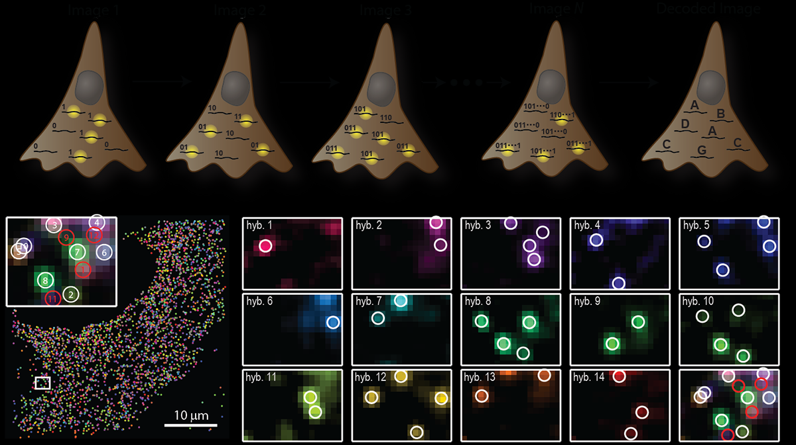
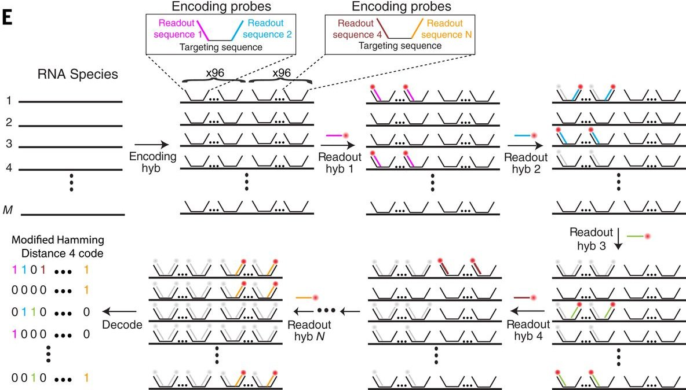
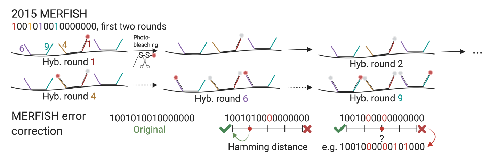
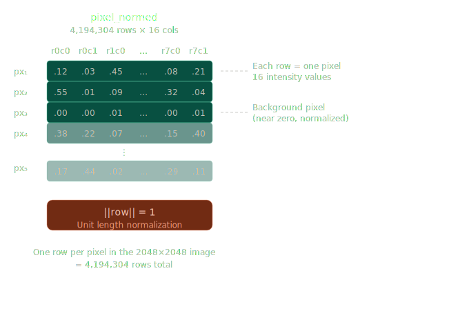
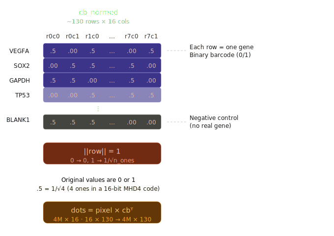
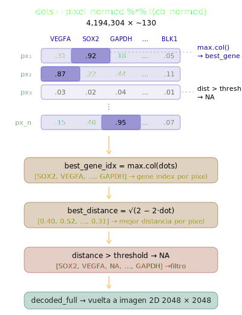

## Cómo llegar a una matriz de expresión a partir de imágenes?

Adaptamos el [tutorial de starfish](https://github.com/spacetx/starfish/blob/master/notebooks/MERFISH.ipynb) (Python) que reproduce el *pipeline* de [Chen et al., 2015](https://www.science.org/doi/10.1126/science.aaa6090), el *paper* original de MERFISH.

Utilizando un subset de los datos publicados en [Moffitt et al., 2016](https://doi.org/10.1073/pnas.1612826113): 8 rondas, 2 canales y un sólo plano Z: 16 x 2048 x 2048.

El test data es el fov 0. Si instalas starfish, y utilizas el notebook.

``` python
experiment = data.MERFISH(use_test_data=use_test_data)
```

Pero mejor descargarlos del drive. Descarga uno o varios FoVs al azar

<https://drive.google.com/drive/folders/1WjiKyYCwBqaxfkRgYg3hdZ-Pa-x1HcBY?usp=sharing>


------------------------------------------------------------------------

## El problema: medición de la expresión génica *in situ*

::::: columns
::: {.column width="50%"}
Abordajes previos

- **scRNA-seq** → high throughput, resolución pero **no información espacial**
- **(F)ISH** (Fluorescent *in situ* hybridization) → espacial, pero típicamente **1–2 genes** a la vez
  - Aunque [HCR](https://pmc.ncbi.nlm.nih.gov/articles/PMC10941662/) está llevando el límite hasta 10!


Queremos escala transcriptómica: **al menos cientos e idealmente miles de genes**, **resolución single-cell y contexto de tejido.**


:::

::: {.column width="50%"}


MERFISH (Multiplexed Error-Robust FISH) lo resuelve codificando cada mRNA de un gen distinto con un **Código de barras binario** que se detecta a lo largo de rondas secuenciales de microscopía.

Sistema comercial: **Vizgen Merscope**

{fig-align="center" height="400"}
:::
:::::

------------------------------------------------------------------------

## El concepto detrás de MERFISH

::::: columns
::: {.column width="50%"}
**La idea es genial:**

1.  Marcar cada especie de RNA **sondas** que codifican en conjunto una secuencia binaria
2.  Hacer **N rondas** de hibridación con sondas fluorescentes
3.  En cada ronda, algunos RNAs se detectan (bit = 1), algunos no (bit = 0)
4.  A lo largo de las rondas, el patrón es el código de barras que identifica al gene


Con 16 bits (8 rondas × 2 canales), teóricamente se podrían codificar **miles** de códigos de barras únicos. ¿Cuántos?


:::

::: {.column width="50%"}
{fig-align="center" width="auto"}

. . .

2\^16 = 65,536

:::
:::::

------------------------------------------------------------------------

## Códigos de barra robustos a errores

No se utilizan todos los posibles códigos binarios. Si se deja una **distancia Hamming mínima de 4**(MHD4):

{fig-align="center" height="350"}

. . .

- **Errores de 1 bit** pueden **corregirse**.
- **Errores de 2 bits** pueden **detectarse** y eliminarse.

. . .

Es crucial por el ruido intrínseco de las imágenes de microscopía fluorescente: *spots* no detectados, hibridación no específica de las sondas, fotoblanqueo, pueden introducir bits erróneos.

## Datos de hoy: Vizgen MERFISH

Adaptación del tutorial del paquete [starfish](https://spacetx-starfish.readthedocs.io/en/latest/gallery/pipelines/merfish_pipeline.html) en python (SpaceTx consortium):

- **Células U-2 OS** (human osteosarcoma cell line)
- **\~100 genes** codificados por **16-bit MHD4**
- **8 rondas de hibridación × 2 canales** = 16 imágenes
- Cada imagen: **2048 × 2048 pixeles**, plano-z único
- Plus: imagen de **núcleos marcados con DAPI**, **libro de códigos (codebook)**, **factores de escala**

-------------------------------------------------------------------

Utilizaremos un grupo de datos reales de Merfish. Los pasos a seguir son

1.  **Preprocesar** imágenes en FIJI (filtrado y deconvolución)
2.  **Decodificar** cada pixel de acuerdo al barcode y asignarlo a un gen en R
3.  **Comparar** los resultados con un *benchmark*.csv

. . .

> Son datos de "juguete". La idea es que no haya cajas negras.
>
> Las plataformas comerciales hacen este pre-procesamiento, pero no es posible saber en el futuro si serán las mismas. Mejor aprender conceptos. Saber las limitaciones del *pipeline.*

--------------------------------------------------------------

## Vista general del pre-procesamiento

Las imágenes crudas tienen ruido y fluorescencia de fondo (background).

**Pipeline (en FIJI):**

| Paso | Método | Propósito |
|----------------------|-------------------|-------------------------------|
| 1\. Filtro High-pass | Gaussian, σ=3 | Quitar fondo de baja frecuencia |
| 2\. Deconvolución | Richardson-Lucy/Unsharp mask | Definir los puntos fluorescentes |
| 3\. Filtro Low-pass | Gaussian, σ=1 | Suavizar el ruido nivel pixel (usualmente del detector) |

------------------------------------------------------------------------

### Primer filtro Gaussian high pass

Mantiene señal de alta frecuencia (púntitos) y quita señal de baja frecuencia (background, autofluorescencia)

**High-passed = Original − GaussianBlur(Original, σ=3)**

. . .


::: callout-tip
Abriremos el hyperstack en FIJI and experiment with different σ values (1, 3, 10). Mayor σ = más agresivo la remoción de background.
:::

------------------------------------------------------------------------

#### Los datos crudos

#### 1. Identifica ruta a tus imágenes

{fig-alt="Identifica ruta a imágenes que descargaste" fig-align="center"}

------------------------------------------------------------------------

#### 2. import image sequence


------------------------------------------------------------------------

#### 3.Browse al directorio con las imagenes


. . .

::: callout-tip
ℹ️ Escribimos "round" para que solo abra las imagenes (count debe cambiar a 16)
:::

------------------------------------------------------------------------

#### 4. stack to hyperstack


------------------------------------------------------------------------

#### 5. 2 canales y 8 ronda


. . .

::: callout-tip
ℹ️ También cambia el modo de "Color" a "Composite"
:::

------------------------------------------------------------------------

#### 6. Selecciona el stack


------------------------------------------------------------------------

#### 7. duplicate


------------------------------------------------------------------------

#### 8. Cambia nombre a gauss3


------------------------------------------------------------------------

#### 9. selecciona la nueva copia


------------------------------------------------------------------------

#### 10. Click en Blur Gaussiano


------------------------------------------------------------------------

#### 11. Sigma 3


**ℹ️** NO scaled units. Puedes experimentar con 5..10

------------------------------------------------------------------------

#### 12. Selecciona Image Calculator


------------------------------------------------------------------------

#### 13. Resta el blur a la original


**ℹ️** Manten output de 32 bits

------------------------------------------------------------------------

#### 14. Click "OK"


------------------------------------------------------------------------

#### 15.Image - Adjust Brightness & Contrast


**ℹ️** (Shift + C) No cambia nuestros datos, sólo el mapeo a nuestra pantalla para poder verlo.

------------------------------------------------------------------------

### Paso 2: Deconvolución

Cuestión inherente a la microscopía óptica. Una fuente de luz puntual se difumina por la difracción a un punto más ancho. La **Point Spread Function**, PSF. La deconvolución sirve para revertir esto.

. . .

**En FIJI:**

- Richardson-Lucy deconvolution (via Deconvolution Lab 2 plugin)
- O **Unsharp Mask** como aprox: Process → Filters → Unsharp Mask (σ=2, weight=0.6)

------------------------------------------------------------------------

#### 1. Unsharp mask


------------------------------------------------------------------------

#### 2. sigma 2 pixeles


------------------------------------------------------------------------

#### 3. Renombra la imagen a algo informativo


------------------------------------------------------------------------

#### 4. Aqui "Unsharped fov_377"


------------------------------------------------------------------------

### Paso 3: Filtro gaussiano (low-pass)

Pequeño desenfoque (σ=1) para suavizar el ruido a nivel pixel.

. . .

**En FIJI:**

Process → Filters → Gaussian Blur → σ = 1

. . .

Luego de estos tres pasos, tenemos un hyperstack limpio listo para la de-codificación.

**Save as:** `merfish_preprocessed_fov_NNN.tif`

------------------------------------------------------------------------

## Cargando los datos en R

Acá es muy importante modificar fov al tuyo

```{r}
#| label: load-data
#| echo: true
#| message: true
#| warning: false
library(EBImage)
library(tidyverse)

fov_num <- 457  # change to your FOV number
#No worries, esta lìnea le pone el leading zero
fov_dir <- sprintf("fov_%03d", fov_num)
# Load preprocessed hyperstack (8 rounds x 2 channels = 16 frames)
img <- readImage(paste0("merfish_processed_", fov_dir, ".tif"))
cat("Image dimensions:", dim(img), "\n")
cat("Frames: 8 rounds x 2 channels = 16\n")

# Frame ordering: channel-first
frame_map <- expand.grid(ch = 0:1, r = 0:7)
```

------------------------------------------------------------------------

### Los datos en matriz

```{r}
#| label: show-frames
#| fig-width: 10
#| fig-height: 5
#| code-fold: true
#| code-summary: "Código para graficar las imágenes "
par(mfrow = c(2, 4), mar = c(1, 1, 2, 1))
for (i in seq(2,16, by = 2)) {
  frame <- img[,,i]
  # Clip to 99.5th percentile to handle bright outliers
  upper <- quantile(frame, 0.995)
  frame[frame > upper] <- upper
  frame[frame < 0 ] <- 0
  # Rescale 0-1
  frame <- frame  / (max(frame) - min(frame))
 display(normalize(frame), method = "raster")

   #image(frame, col = grey.colors(256),
   #     main = paste0("Round ", frame_map$r[i], " Ch ", frame_map$ch[i]),
 #       axes = FALSE)
}
```

Cada punto es un cluster de sondas fluorescentes unida a una molécula de RNA. En cada ronda y canal, **differentes genes se detectan** dependiendo de su código.

------------------------------------------------------------------------

### El *codebook* es la correspondencia de *barcodes* a genes

```{r}
#| label: codebook
codebook <- read.csv("codebook.csv", row.names = 1)

# Show first 6 genes
slice_sample(codebook, n =5) %>%
  knitr::kable(caption = "Cada fila un gene, cada columna 1 bit ronda/canal. 1 = fluorescente")
```

. . .

**Cada gen tiene un patrón único de 0s y 1s**

Decodificación es mapear la señal observada de cada pixel al código más cercano.

------------------------------------------------------------------------

### Normalización por factor de escala

Cada bit (ronda/canal) tiene diferente fluorescencia. Hace falta normalizar.

```{r}
#| label: scale-factors
#Ajust el path de acuerdo a donde guardaste los archivos
sf <- read.csv(file.path(fov_dir, "scale_factors.csv"))

# Show the variation
ggplot(sf, aes(x = factor(r), y = scale_factor, fill = factor(c))) +
  geom_col(position = "dodge") +
  labs(x = "Ronda", y = "Factor de escala", fill = "Canal",
       title = "La intensidad de fluorescencia varía entre canales y rondas") +
  theme_minimal()
```

------------------------------------------------------------------------

### Aplicando los factores de escala

```{r}
#| label: normalize
img_norm <- img
for (i in 1:16) {
  r <- frame_map$r[i]
  ch <- frame_map$ch[i]
  scale_val <- sf$scale_factor[sf$r == r & sf$c == ch]
  img_norm[,,i] <- img[,,i] / scale_val
  cat(sprintf("Frame %2d (r=%d, c=%d) / %.3f\n", i, r, ch, scale_val))
}
```

Ahora podemos comparar las intensidades de fluorescencia entre los distintos bits.

## Algoritmo decodificador

Cada pixel es un **vector de longitud 16 con valores de intensidad** (one valor por round/channel).

1.  **Normalizar** cada pixel a una longitud unitaria (norma L2 o euclidiana)
2.  **Normalizar** cada código del libro a longitud 1.
3.  **Calcular la distancia Euclidina** entre el vector pixel y cada código del libro.
4.  **Assignar** a cada pixel el gen más cercano si la distancia \< threshold

. . .

Truco para usar producto punto (convertir cosine similarity a distancia euclidiana) $$d(\mathbf{p}, \mathbf{c}) = \sqrt{2 - 2 \cdot \frac{\mathbf{p} \cdot \mathbf{c}}{||\mathbf{p}|| \cdot ||\mathbf{c}||}}$$

La manera naïve

```{r}
#| label: dont
#| eval: false
#| echo: true
#| message: false
#| warning: false
# Takes longer??
for (i in 1:nrow(pixel_matrix)) {
  for (j in 1:nrow(cb_matrix)) {
    d[i,j] <- sqrt(sum((pixel_normed[i,] - cb_normed[j,])^2))
  }
}
```

------------------------------------------------------------------------

### Preparando decodificación en R

```{r}
#| label: decode-setup
#| code-fold: true
#| code-summary: "Normalización de las matrices de pixeles y códigos"

# Reshape image into pixel matrix: n_pixels x 16
nx <- dim(img_norm)[1]
ny <- dim(img_norm)[2]
pixel_matrix <- matrix(img_norm, nrow = nx * ny, ncol = 16)

# Normalize pixels to unit length
pixel_norms <- sqrt(rowSums(pixel_matrix^2))
pixel_normed <- pixel_matrix / pixel_norms
pixel_normed[is.nan(pixel_normed)] <- 0

# Normalize codebook to unit length
col_order <- paste0("r", frame_map$r, "_c", frame_map$ch)
codebook_ordered <- codebook[, col_order]
cb_matrix <- as.matrix(codebook_ordered)
#Dumb to take square root they are all ones
cb_norms <- sqrt(rowSums(cb_matrix^2))
cb_normed <- cb_matrix / cb_norms
```

::::: columns
::: {.column width="50%"}

:::

::: {.column width="50%"}

:::
:::::

------------------------------------------------------------------------

### Decodificación en R encontrando los matches

threshold es tunable pero este es el que usan en el tutorial de starfish

::::: columns
::: {.column width="50%"}
```{r}
#| label: decode-run
#| code-fold: false
#| code-summary: "Código de decodificación"
# Dot product: pixel similarity to each codeword
cat("Computing dot products...\n")
dots <- pixel_normed %*% t(cb_normed)
# Find best match per pixel (vectorized — fast!) BaseR
best_gene_idx <- max.col(dots, ties.method = "first")
#Highest cosine similarity for each pixel
best_dot <- dots[cbind(1:nrow(dots), best_gene_idx)]
#Por si las moscas (que no de negativo)
best_distance <- sqrt(2 - 2 * pmin(best_dot, 1))
# Apply distance threshold
threshold <- .572
decoded <- best_gene_idx
decoded[best_distance > threshold] <- NA
# Reshape to image
decoded_full <- matrix(decoded, nrow = nx, ncol = ny)
gene_names <- rownames(codebook)
cat(sprintf("Decoded %d out of %d pixels (%.1f%%)\n",
            sum(!is.na(decoded)), length(decoded),
            100 * sum(!is.na(decoded)) / length(decoded)))
```
:::

::: {.column width="50%"}
{width="550"}
:::
:::::

------------------------------------------------------------------------

### The decoded image

```{r}
#| label: decoded-image
#| fig-width: 8
#| fig-height: 8
image(decoded_full, col = c("black", rainbow(length(gene_names))),
      main = "Genes decodificados: 140 colores ",
      useRaster = TRUE, axes = FALSE)
```

Cada pixel tiene asignada un gen de acuerdo a su patrón de intensidad a lo largo de 16 rondas de microscopía (Arcoiris con 140 colores, difícil distinguir)

------------------------------------------------------------------------

### Validación comparando con un benchmark

```{r}
#| label: benchmark
#| fig-width: 7
#| fig-height: 7
#| code-fold: true
#| code-summary: "Código benchmark"

# Published benchmark results
bench <- read.csv(
  "https://d2nhj9g34unfro.cloudfront.net/MERFISH/benchmark_results.csv",
  colClasses = c("barcode" = "character")
)

bench_counts <- bench %>%
  group_by(gene) %>%
  summarise(benchmark = n())

# Our decoded counts
decoded_vector <- as.vector(decoded_full)
decoded_genes <- gene_names[decoded_vector[!is.na(decoded_vector)]]

our_counts <- data.frame(gene = decoded_genes) %>%
  group_by(gene) %>%
  summarise(ours = n())

# Compare
comparison <- inner_join(bench_counts, our_counts, by = "gene")
r_val <- cor(comparison$benchmark, comparison$ours)

ggplot(comparison, aes(x = benchmark, y = ours)) +
  geom_point(size = 2, alpha = 0.6, color = "#00BFC4") +
  geom_abline(slope = 1, intercept = 0, linetype = "dashed", color = "white") +
  scale_x_log10() +
  scale_y_log10() +
  labs(x = "Gene copy number (published benchmark)",
       y = "Gene copy number (our R pipeline)",
       title = paste0("Correlation: r = ", round(r_val, 3))) +
  theme_minimal() +
  theme(plot.background = element_rect(fill = "grey20"),
        panel.background = element_rect(fill = "grey20"),
        text = element_text(color = "white"),
        axis.text = element_text(color = "grey80"))
```

## Lo que tenemos hasta ahora

De los pasos anteriores:

- `merfish_preprocessed_fovNNN.tif` — hyperstack de 16 frames (8 rounds × 2 canales)
- `codebook.csv` — barcodes de genes
- `scale_factors.csv` — normalización de intensidad
- `decoded_full` — matriz 2048×2048 de índices de genes (de la decodificación en R)

Las hice con Cellpose - `fov_NNN/cell_masks.tif` — máscaras de Cellpose - `fov_NNN/expanded_masks.tif` — expansión Voronoi máximo 50 pixeles

. . .

**Objetivo:** combinar genes decodificados, asignarlo a células y crear un objeto espacial de Seurat

------------------------------------------------------------------------

## Preparando datos para objeto Seurat

```{r}
#| label: load-ingredients
library(Seurat)
library(dplyr)
library(tiff)
library(Matrix)
library(ggplot2)


# 1. Nuclei image. 
nuclei <- readTIFF(file.path(fov_dir, "nuclei_DAPI.tiff"))
#Readtiff transpone las imágenes respecto a ebiimage 
nuclei <- t(nuclei)


# 2. Cell masks (Voronoi-expanded from Cellpose)
expanded_masks <- readTIFF(file.path(fov_dir, "expanded_masks.tif"), as.is = TRUE)
#Physicists vs engineers
expanded_masks <- t(expanded_masks)

# 3. Nuclei-only masks (for comparison)
cell_masks <- readTIFF(file.path(fov_dir, "cell_masks.tif"), as.is = TRUE)
cell_masks <- t(cell_masks)
# 4. Your decoded image (from the decoding pipeline)
# decoded_full and gene_names should be in your environment

cat(sprintf("Nuclei image:  %s\n", paste(dim(nuclei), collapse = "x")))
cat(sprintf("Cell masks:    %d cells\n", length(unique(expanded_masks[expanded_masks > 0]))))
cat(sprintf("Decoded genes: %d pixels assigned\n", sum(!is.na(decoded_full))))
```

------------------------------------------------------------------------

### Visualizar: DAPI + segmentación

```{r}
#| label: viz-segmentation
#| fig-width: 10
#| fig-height: 5
#| code-fold: true
#| code-summary: "Código nucleos y segmentación"

par(mfrow = c(1, 3), mar = c(1, 1, 2, 1))

# DAPI
dapi_disp <- nuclei
upper <- quantile(dapi_disp, 0.995)
dapi_disp[dapi_disp > upper] <- upper
dapi_disp <- (dapi_disp - min(dapi_disp)) / (max(dapi_disp) - min(dapi_disp))
image(dapi_disp, col = grey.colors(256), main = "DAPI nuclei", axes = FALSE)

# Nuclei masks
image(cell_masks, col = c("black", rainbow(max(cell_masks))),
      main = "Nuclei masks (Cellpose)", axes = FALSE)

# Expanded cell masks
image(expanded_masks, col = c("black", rainbow(max(expanded_masks))),
      main = "Cell masks (Voronoi, 50px)", axes = FALSE)
```

------------------------------------------------------------------------

### Asignar transcritos a células

```{r}
#| label: assign-transcripts

# Each pixel that has BOTH a decoded gene AND falls inside a cell mask
# gets counted for that cell
has_gene <- !is.na(decoded_full)
has_cell <- expanded_masks > 0
valid <- has_gene & has_cell

gene_vec <- gene_names[decoded_full[valid]]
cell_vec <- expanded_masks[valid]

transcript_table <- data.frame(
  cell = cell_vec,
  gene = gene_vec,
  stringsAsFactors = FALSE
)

cat(sprintf("Total decoded pixels:     %d\n", sum(has_gene)))
cat(sprintf("Pixels inside cells:      %d\n", sum(valid)))
cat(sprintf("Pixels outside cells:     %d\n", sum(has_gene & !has_cell)))
cat(sprintf("Fraction assigned: %.1f%%\n",
            100 * sum(valid) / sum(has_gene)))
```

------------------------------------------------------------------------

### Contruir la matriz de conteo

```{r}
#| label: count-matrix

# Cross-tabulate: genes (rows) × cells (columns)
count_table <- table(transcript_table$gene, transcript_table$cell)
count_matrix <- as(count_table, "sparseMatrix")

# Clean column names
colnames(count_matrix) <- paste0("cell_", colnames(count_matrix))

cat(sprintf("Count matrix: %d genes × %d cells\n",
            nrow(count_matrix), ncol(count_matrix)))
cat(sprintf("Total counts: %d\n", sum(count_matrix)))
cat(sprintf("Median counts/cell: %.0f\n", median(colSums(count_matrix))))
cat(sprintf("Median genes/cell: %.0f\n",
            median(colSums(count_matrix > 0))))
```

------------------------------------------------------------------------

### Distribución de conteos por célula

```{r}
#| label: counts-distribution
#| fig-width: 8
#| fig-height: 4

counts_per_cell <- colSums(count_matrix)
genes_per_cell <- colSums(count_matrix > 0)

par(mfrow = c(1, 2), mar = c(4, 4, 2, 1))
hist(counts_per_cell, breaks = 50, col = "steelblue",
     main = "Transcripts per cell", xlab = "Count")
hist(genes_per_cell, breaks = 50, col = "coral",
     main = "Genes detected per cell", xlab = "Count")
```

------------------------------------------------------------------------

### Metadatos celulares

```{r}
#| label: cell-metadata

# Compute centroids and area from the cell masks
cell_ids <- sort(unique(as.vector(expanded_masks)))
cell_ids <- cell_ids[cell_ids > 0]

# Use EBImage to compute features
props_moment <- computeFeatures.moment(expanded_masks)
props_shape <- computeFeatures.shape(expanded_masks)

cell_meta <- data.frame(
  cell = paste0("cell_", cell_ids),
  center_x = props_moment[, "m.cx"],
  center_y = props_moment[, "m.cy"],
  area = props_shape[, "s.area"],
  fov = fov_num,
  stringsAsFactors = FALSE
)
rownames(cell_meta) <- cell_meta$cell

# Keep only cells that appear in count matrix
cell_meta <- cell_meta[colnames(count_matrix), ]
cat(sprintf("Metadata for %d cells\n", nrow(cell_meta)))
head(cell_meta)
```

------------------------------------------------------------------------

### Crear el objeto Seurat (Voronoi)

```{r}
#| label: create-seurat

seurat_voronoi <- CreateSeuratObject(
  counts = count_matrix,
  meta.data = cell_meta,
  assay = "MERFISH"
)

# Add spatial coordinates as centroids
coords <- data.frame(
  x = cell_meta$center_x,
  y = cell_meta$center_y,
  cell = cell_meta$cell
)

cents <- CreateCentroids(coords)
segmentations.data <- list(
  "centroids" = cents
)

fov_label <- sprintf("fov_%03d", fov_num)
fov_obj <- CreateFOV(
  coords = segmentations.data,
  type = c("centroids"),
  molecules = NULL,
  assay = "MERFISH"
)

seurat_voronoi[[fov_label]] <- fov_obj

print(seurat_voronoi)
```

------------------------------------------------------------------------

### Pero... ¿qué tan buena es la asignación?

```{r}
#| label: viz-assignment
#| fig-width: 8
#| fig-height: 8
#| code-fold: true
#| code-summary: "Código genes asignados"

par(mar = c(1, 1, 2, 1))

# Base layer: nuclei masks in grey on white
image(cell_masks > 0, col = c("white", "grey80"),
      main = "Transcript assignment", axes = FALSE)

# Assigned transcripts (cyan)
assigned_coords <- which(valid, arr.ind = TRUE)
if (nrow(assigned_coords) > 50000) {
  idx <- sample(nrow(assigned_coords), 50000)
  assigned_coords <- assigned_coords[idx, ]
}
points(assigned_coords[,1] / nrow(decoded_full),
       assigned_coords[,2] / ncol(decoded_full),
       pch = 16, cex = 0.4, col = adjustcolor("cyan", 0.7))

# Unassigned transcripts (red)
unassigned_mask <- has_gene & !has_cell
unassigned_coords <- which(unassigned_mask, arr.ind = TRUE)
if (nrow(unassigned_coords) > 50000) {
  idx <- sample(nrow(unassigned_coords), 50000)
  unassigned_coords <- unassigned_coords[idx, ]
}
points(unassigned_coords[,1] / nrow(decoded_full),
       unassigned_coords[,2] / ncol(decoded_full),
       pch = 16, cex = 0.4, col = adjustcolor("red", 0.7))

# Legend
legend("bottomright", pch = 16, col = c("grey80", "cyan", "red"),
       legend = c("Nuclei", 
                  sprintf("Assigned (%d)", sum(valid)),
                  sprintf("Unassigned (%d)", sum(has_gene & !has_cell))),
       bg = "white", cex = 0.9)
```

. . .

La expansión Voronoi es geométrica, no biológica. Muchos transcritos citoplasmáticos quedan sin asignar. ¿Se puede mejorar?

## Opción avanzada: Proseg

[Proseg](https://github.com/dcjones/proseg) usa un modelo probabilístico (Cellular Potts) que inicializa con los núcleos y **expande las células hasta explicar la distribución espacial de transcritos** utilizando Cellular Potts Model.

. . .

Para una aplicación de CPM en mecanobiología de la regeneración, chequen este [artículo](https://www.sciencedirect.com/science/article/pii/S0022519326000159) reciente en Journal of Theoretical Biology

------------------------------------------------------------------------

### Exportar transcritos para Proseg

```{r}
#| eval: false
#| include: true
# Export decoded transcripts as a point cloud
coords <- which(!is.na(decoded_full), arr.ind = TRUE)

transcripts_df <- data.frame(
  x = coords[, 1],
  y = coords[, 2],
  gene = gene_names[decoded_full[coords]],
  cell_id = expanded_masks[coords]  # 0 = not in any nucleus
)

# Remove BLANKs if you want
transcripts_df <- transcripts_df[!grepl("BLANK", transcripts_df$gene), ]

transcripts_df$z <- 0

cat(sprintf("Exporting %d transcripts for %d genes\n",
            nrow(transcripts_df), length(unique(transcripts_df$gene))))

write.csv(transcripts_df, file.path(fov_dir, "transcripts_for_proseg.csv"), row.names = FALSE)
```

------------------------------------------------------------------------

### Segmentación con Proseg

```{bash}
#| eval: false
proseg \
  --x-column x \
  --y-column y \
  --z-column z \
  --gene-column gene \
  --cell-id-column cell_id \
  --cell-id-unassigned 0 \
  --voxel-layers 1 \
  --expand-initialized-cells 10 \
  --max-transcript-nucleus-distance 200 \
  --voxel-size 4 \
  --burnin-voxel-size 8 \
  --output-cell-metadata proseg_output/cell-metadata.csv.gz \
  --output-transcript-metadata proseg_output/transcript-metadata.csv.gz \
  --output-counts proseg_output/counts.csv.gz \
  --output-cell-polygons proseg_output/cell-polygons.geojson.gz \
  --overwrite \
  transcripts_for_proseg.csv
```

A veces falla si no encuentra proseg_output

------------------------------------------------------------------------

### Cargando resultados de Proseg

```{r}
#| label: load-proseg
#| code-fold: true
#| code-summary: "Cargar datos de proseg"
library(Matrix)
#library(jsonlite)
#library(sf)
library(ggplot2)

# Transcript metadata
tx <- read.delim(gzfile(file.path(fov_dir,"proseg_output/transcript-metadata.csv.gz")), sep = ",")

# Classify transcripts
tx$status <- ifelse(tx$background == "true", "background",
             ifelse(tx$assignment == "", "unassigned", "assigned"))

head(tx)

cat(sprintf("Total transcripts: %d\n", nrow(tx)), "\n",
  sprintf("Assigned to cells:    %d (%.1f%%)\n",
    sum(tx$status == "assigned"),
    100 * sum(tx$status == "assigned") / nrow(tx)),   "\n",
  sprintf("Unassigned: %d (%.1f%%)\n", sum(tx$status == "unassigned"),
    100 * sum(tx$status == "unassigned") / nrow(tx)),  "\n",
  sprintf("Background (noise):   %d (%.1f%%)\n",
    sum(tx$status == "background"),
    100 * sum(tx$status == "background") / nrow(tx)))
```

------------------------------------------------------------------------

### Transcritos asignados vs no asignados

```{r}
#| label: proseg-assignment-viz
#| code-fold: true
#| code-summary: "Visualización de asignación"
#| fig-width: 8
#| fig-height: 8
ggplot() +
  geom_point(data = tx[tx$status == "background", ],
             aes(x = x, y = y), color = "grey50", size = 0.1, alpha = 0.3) +
  geom_point(data = tx[tx$status == "unassigned", ],
             aes(x = x, y = y), color = "red", size = 0.3, alpha = 0.5) +
  geom_point(data = tx[tx$status == "assigned", ],
             aes(x = x, y = y), color = "cyan", size = 0.3, alpha = 0.5) +
  coord_equal() +
  labs(title = "Proseg: asignación de transcritos",
       subtitle = sprintf("Asignados: %d | Sin asignar: %d | Ruido: %d",
                          sum(tx$status == "assigned"),
                          sum(tx$status == "unassigned"),
                          sum(tx$status == "background"))) +
  theme_void()
```

------------------------------------------------------------------------

### Transcritos coloreados por célula

```{r}
#| label: proseg-transcripts-by-cell
#| code-fold: true
#| code-summary: "Transcritos por célula"
#| fig-width: 8
#| fig-height: 8
assigned_tx <- tx[tx$status == "assigned", ]
set.seed(42)
n_cells <- nrow(cell_meta)
cell_colors <- sample(colors(distinct = TRUE)[1:n_cells])
ggplot() +
  geom_point(data = assigned_tx,
             aes(x = x, y = y, color = factor(assignment)),
             size = 0.2, alpha = 0.6, show.legend = FALSE) +
  scale_color_manual(values = cell_colors) +
  theme_void() +
  labs(title = "Asignación con proseg",
       subtitle = "Cellular Potts model") +
  theme(panel.background = element_rect(fill = "black"))
```

------------------------------------------------------------------------

### ¿Qué nos da Proseg?

Aunque tiene opciones para cargar y producir archivos listos para scanpy o Seurat

| Archivo                      | Contenido                         |
|------------------------------|-----------------------------------|
| `counts.csv.gz`              | Matriz celda × gen (MatrixMarket) |
| `cell-metadata.csv.gz`       | Centroides, volumen, área         |
| `transcript-metadata.csv.gz` | Asignación por transcrito + QC    |
| `cell-polygons.geojson.gz`   | Contornos celulares               |

. . .

A diferencia de la expansión Voronoi, Proseg:

- Modela la **forma real** de las células (incluyendo filopodios)
- Clasifica transcritos como **señal vs ruido** (*background*)
- Genera **conteos fraccionales** (estimación probabilística)
- Puede reposicionar transcritos que **difundieron** de células vecinas

------------------------------------------------------------------------

### Construyendo el objeto Seurat (proseg)

```{r}
#| label: seurat-from-proseg
#| code-fold: true
#| code-summary: "Crear objeto Seurat"
library(Seurat)

# Count matrix (MatrixMarket format)
count_matrix <- t(readMM(gzfile(file.path(fov_dir,"proseg_output/counts.csv.gz"))))
all_genes <- sort(unique(tx$gene))
rownames(count_matrix) <- all_genes
colnames(count_matrix) <- paste0("cell_", 1:ncol(count_matrix))

cat(sprintf("Matriz: %d genes × %d células\n",
            nrow(count_matrix), ncol(count_matrix)))

# Cell metadata
cell_meta_proseg <- read.csv(gzfile(file.path(fov_dir,"proseg_output/cell-metadata.csv.gz")))
rownames(cell_meta_proseg) <- colnames(count_matrix)

# Create Seurat object
seurat_proseg <- CreateSeuratObject(
  counts = count_matrix,
  meta.data = cell_meta_proseg,
  assay = "MERFISH"
)

# Add spatial coordinates
coords <- data.frame(
  x = cell_meta_proseg$centroid_x,
  y = cell_meta_proseg$centroid_y,
  cell = rownames(cell_meta_proseg)
)

cents <- CreateCentroids(coords)
fov_obj <- CreateFOV(
  coords = list("centroids" = cents),
  type = "centroids",
  molecules = NULL,
  assay = "MERFISH"
)
seurat_proseg[[fov_dir]] <- fov_obj

print(seurat_proseg)
```

------------------------------------------------------------------------

### **Elegir tu objeto y continuar**

```{r}
#| label: choose-object
# Si tienes Proseg:
seurat_obj <- seurat_proseg
cell_meta <- cell_meta_proseg

# Si no tienes Proseg:
# seurat_obj <- seurat_voronoi
# cell_meta ya está definido de antes

```

. . .

A partir de aquí, el pipeline es **idéntico** independientemente de cómo se hizo la segmentación.

------------------------------------------------------------------------

## Pipeline estándar de Seurat

```{r}
#| label: seurat-pipeline-proseg
#| code-fold: true
#| code-summary: "Pipeline Seurat"
seurat_obj <- NormalizeData(seurat_obj)
seurat_obj <- FindVariableFeatures(seurat_obj)
seurat_obj <- ScaleData(seurat_obj)
seurat_obj <- RunPCA(seurat_obj, npcs = 15)
seurat_obj <- RunUMAP(seurat_obj, dims = 1:10)
seurat_obj <- FindNeighbors(seurat_obj, dims = 1:10)
seurat_obj <- FindClusters(seurat_obj, resolution = 1)
```

------------------------------------------------------------------------

### UMAP y mapa espacial

```{r}
#| label: umap-spatial-proseg
#| code-fold: true
#| code-summary: "Visualización UMAP + espacial"
#| fig-width: 12
#| fig-height: 5
library(patchwork)

p1 <- DimPlot(seurat_obj, reduction = "umap", label = TRUE, pt.size = 5) +
  ggtitle("UMAP — clusters") +
  theme_minimal()

p2 <- ggplot(data.frame(x = cell_meta$centroid_x,
                        y = cell_meta$centroid_y,
                        cluster = seurat_obj$seurat_clusters),
             aes(x = x, y = y, color = cluster)) +
  geom_point(size = 5) +
  coord_equal() +
  labs(title = "Clusters en el tejido") +
  theme_minimal() +
  theme(panel.background = element_rect(fill = "black"))

p1 + p2
```

------------------------------------------------------------------------

### Marcadores por cluster

```{r}
#| label: markers-proseg
#| code-fold: true
#| code-summary: "Marcadores"
markers <- FindAllMarkers(seurat_obj,
                          only.pos = TRUE,
                          min.pct = 0.1,
                          logfc.threshold = 0.25)

top_markers <- markers %>%
  group_by(cluster) %>%
  slice_max(avg_log2FC, n = 5)

print(top_markers[, c("cluster", "gene", "avg_log2FC", "p_val_adj")])

```

------------------------------------------------------------------------

### Heatmap de marcadores

```{r}
#| label: heatmap
#| fig-width: 10
#| fig-height: 6
#| code-fold: true
#| code-summary: "Heatmap"
top5 <- top_markers %>%
  group_by(cluster) %>%
  slice_max(avg_log2FC, n = 5) %>%
  pull(gene) %>%
  unique()

DoHeatmap(seurat_obj, features = top5) +
  scale_fill_viridis_c()

```

------------------------------------------------------------------------

### Expresión espacial de un gen

```{r}
#| label: spatial-gene-proseg
#| code-fold: true
#| code-summary: "Expresión espacial"
#| fig-width: 8
#| fig-height: 7
gene_of_interest <- sample(top_markers$gene, 1)
expr <- FetchData(seurat_obj, vars = gene_of_interest)
gene_tx <- tx[tx$gene == gene_of_interest & tx$background == "false" , ]

# Count spots per cell for this gene
spots_per_cell <- table(gene_tx$assignment)

# Build plot data with labels
plot_df <- data.frame(
  x = cell_meta$centroid_x,
  y = cell_meta$centroid_y,
  expression = expr[, 1],
  cell_id = cell_meta$cell
)
# Match spot counts to cells (0-indexed from proseg)
plot_df$n_spots <- as.integer(spots_per_cell[as.character(0:(nrow(plot_df) - 1))])
plot_df$n_spots[is.na(plot_df$n_spots)] <- 0
plot_df$label <- paste0(plot_df$cell_id, ": ", plot_df$n_spots)

ggplot(plot_df, aes(x = x, y = y)) +
  geom_point(aes(color = expression), size = 10) +
  scale_color_viridis_c(option = "magma") +
  geom_text(aes(label = label), size = 4, color = "black",
            vjust = -1) +
  geom_point(data = gene_tx, aes(x = x, y = y),
             color = "red", size = 1, alpha = 0.8, shape = 8, position = "jitter") +
  coord_equal() +
  labs(title = paste0("Gen: ", gene_of_interest),
       subtitle = "Expresión normalizada vs transcritos crudos") +
  theme_minimal()

```

------------------------------------------------------------------------

## Tarea

Por equipos: exportar los objetos seurat como h5

Subiré en algún momento el umap y los datos integrados de todos

------------------------------------------------------------------------

## Overview

```         
Imágenes crudas de fluorescencia (16 TIFFs)
    │
    ▼ FIJI: filtro high-pass, deconvolución, blur
Hyperstack preprocesado
    │
    ▼ R: normalización por scale factors
Tensor de intensidades normalizado
    │
    ▼ R: decodificación pixel (distancia coseno al codebook)
Mapa de genes decodificado (2048×2048)
    │
    ├──────────────────────────────┐
    ▼                              ▼
    Cellpose + Voronoi             Proseg (Cellular Potts)
    Segmentación geométrica        Segmentación probabilística
    │                              │
    ▼                              ▼
    Objeto Seurat                  Objeto Seurat
    │                              │
    └──────────────┬───────────────┘
                   ▼
    Seurat: normalizar, PCA, UMAP, clustering
                   ▼
    Análisis espacial unicelular
```

------------------------------------------------------------------------

## A pesar de todo, nos faltó:

In a real pipeline (Vizgen MERSCOPE, 10x Xenium):

- **Multi-FOV stitching** Reconstruir un mosaico de cientos de campos (field of view)
- **Procesamiento 3D z-stack**
- **Correción cromática y registro** alinear canales y rondas si DIY
- **Análisis de componentes conectados** Este pipeline es "pixel-based" pero también hay "spot-based"
- **Segmentación celular** Más que mejores algoritmos, plataformas como Xenium usan tinción adicional citoplásmica (ej. PolyA) y membranal

## De *raw* a archivos finales

| Processing step       | What it produces     | Vizgen output file         |
|-----------------------|----------------------|----------------------------|
| Decoding              | Transcript locations | `detected_transcripts.csv` |
| Cell segmentation     | Cell boundaries      | `cell_boundaries/`         |
| Segmentation metadata | Cell centroids, area | `cell_metadata.csv`        |
| Transcript assignment | Expression matrix    | `cell_by_gene.csv`         |

. . .

Posible que los archivos que descargues de bases de datos sean similares a estos. Ahora sabes qué significan y de dónde vienen.

## Resumen

1.  **MERFISH raw data** y en general ST basado en microscopía son (híper)stacks de diferentes rondas/canales/z y fovs
2.  **Barcodes** Son los cógidos binarios que representan la ausencia o presencia de fluorescia
3.  **Preprocesamiento** (filtrado, registro, deconvolución) para extraer señal de las imágenes. Sensibilidad y especificidad dependen de ello.
4.  **Decoding** cada pixel es un vector de intensidades que hay que comparar contra el código más cercano
5.  **Códigos robustos a errores**
6.  **Plataformas comerciales** automatizan esto, sí, pero ahora conocemos la lógica detrás

## Resources

**Data:**

- [Vizgen Data Release Program](https://vizgen.com/data-release-program/)
- [10x Genomics Xenium datasets](https://www.10xgenomics.com/datasets)
- [Zhuang Lab MERFISH data](https://zhuang.harvard.edu/merfish.html)

**Software:**

- [starfish (Python)](https://github.com/spacetx/starfish) — unified pipeline for image-based transcriptomics
- [EBImage (R/Bioconductor)](https://bioconductor.org/packages/EBImage/) — image processing
- [Seurat](https://satijalab.org/seurat/) — downstream analysis of spatial data

**Papers:**

- Chen et al. (2015) *Science*: Original MERFISH paper
- Moffitt et al. (2016) *Methods in Enzymology*: MERFISH protocol
- Moffitt et al. (2018) *Science:* Hypothalamus cell atlas

## Preguntas

All code and data from this session are available at:

jerolon.github.io

. . .

::: callout-tip
## Cosas a intentar

Cambiar el umbral de decodificación, parámetros de procesamiento, filtros, etc. Implementar connected components en R (o cargar librería que lo hace)
:::

::: ::::::::::::::::
:::
